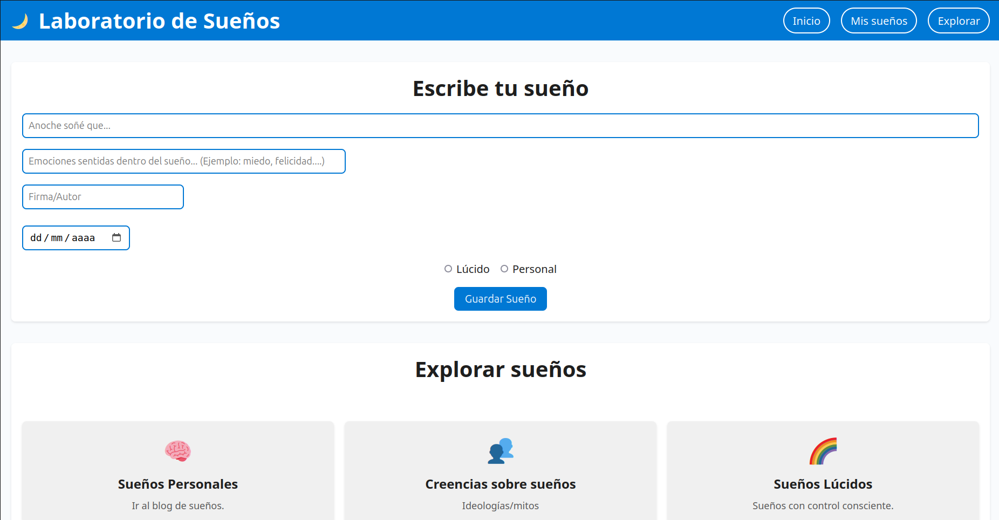
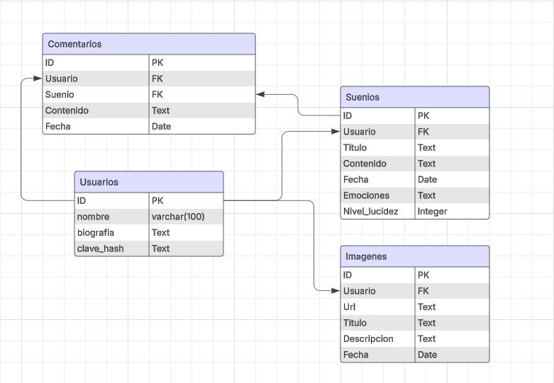

# Trabajo Integrador de Introducción al Desarrollo de Software: Laboratorio de Sueños



# Descripción del proyecto

Sitio web para registrar y explorar sueños personales, colectivos y lúcidos, con vínculos a emociones, simbología y psicología.

---

# Estructura de la Base de Datos



> Las sentencias SQL se encuentran en la carpeta `backend/scripts`.

---

# Cómo arrancar el proyecto

Recomendacion: Antes de levantar el proyecto debes hacer ```bash npm install``` dentro de backend/ para instalar todas las dependecias del proyecto, ademas de tener instalado `Docker`. Deberas tener la carpeta uploads dentro de `backend/src` ya que alli se almacenaran localmente todas las imagenes que se suban a la pagina web.

## 1. Levantar la base de datos con Docker

Ejecutá en la terminal:

```bash
make start-db
```

## 2. Levantar el backend (Api)

Ejecutá en la terminal:

```bash
make start-backend
```

## 3. Levantar el FrontEnd

Ejecutá en otra terminal:

```bash
make start-frontend
```

## Recomendacion
Puedes ejecutar el comando 1 y 2 de la forma:

```bash
make run-backend
```
Esto correra la API y la db al mismo tiempo.